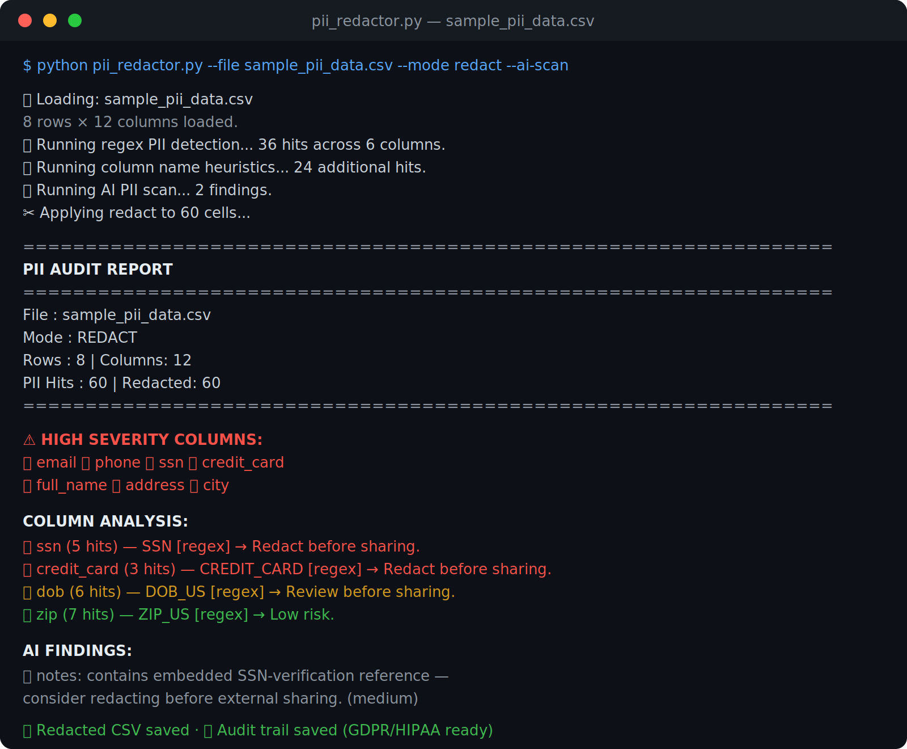

# PII Detection & Redaction in CSV Exports



Scans CSV files for Personally Identifiable Information using regex pattern matching + Claude AI, redacts or pseudonymizes sensitive fields, and produces a GDPR/HIPAA compliance audit trail.


> 📄 See `sample_pii_audit.json` for the full compliance audit trail and `sample_redacted.csv` for the redacted output — no need to run anything to see what this tool produces.

## Features

- 🔍 13 built-in regex patterns (SSN, email, phone, credit card, IBAN, passport, DOB, IP, API keys...)
- 🏷️ Column name heuristics (flags columns named `email`, `dob`, `ssn`, `password`, etc.)
- 🤖 Optional Claude AI scan for context-aware detection regex misses
- ✂️ Three redaction modes: `redact`, `pseudonymize`, `mask`
- 📋 Full JSON audit trail for GDPR/HIPAA compliance documentation
- ⚪ Whitelist columns to preserve (e.g. `product_id`, `order_id`)
- 📄 Outputs clean redacted CSV + compliance audit report

## Installation

```bash
pip install pandas anthropic
export ANTHROPIC_API_KEY=your_key_here
```

## Usage

```bash
# Basic redaction (replace PII with [REDACTED:TYPE])
python pii_redactor.py --file data.csv

# Pseudonymize (replace with consistent hash — preserves join-ability)
python pii_redactor.py --file data.csv --mode pseudonymize

# Mask (show first/last 2 chars, e.g. jo***th)
python pii_redactor.py --file data.csv --mode mask

# Audit only — don't modify data, just report PII found
python pii_redactor.py --file data.csv --mode report-only

# Add AI scan for deeper detection
python pii_redactor.py --file data.csv --ai-scan

# Skip safe columns (won't be scanned or redacted)
python pii_redactor.py --file data.csv --whitelist "product_id,order_id,sku"

# Full options
python pii_redactor.py \
  --file exports/customers.csv \
  --mode pseudonymize \
  --ai-scan \
  --whitelist "customer_id,plan" \
  --output clean/customers_clean.csv \
  --audit-output audits/customers_audit.json
```

## Detection Methods

| Method | What it catches |
|--------|----------------|
| Regex patterns | SSN, email, phone (US/intl), credit cards, IBAN, DOB, IP, ZIP, passport, NPI, API keys |
| Column hints | Columns named `email`, `ssn`, `dob`, `name`, `address`, `password`, `salary`, `diagnosis`... |
| Claude AI | Free-text PII, encoded data, indirect identifiers, combinations that imply identity |

## Redaction Modes

| Mode | Example input | Example output |
|------|---------------|----------------|
| `redact` | `john@example.com` | `[REDACTED:EMAIL]` |
| `pseudonymize` | `john@example.com` | `PSEUDO_EMAIL_3f7a2b1c8d4e` |
| `mask` | `john@example.com` | `jo**************om` |
| `report-only` | _(no changes)_ | Audit report only |

## Sample Audit Output

```
=================================================================
  PII AUDIT REPORT
=================================================================
  File      : sample_pii_data.csv
  Mode      : REDACT
  Rows      : 8  |  Columns: 12
  PII Hits  : 47  |  Redacted: 38

  ⚠️  HIGH SEVERITY COLUMNS:
     🔴 ssn
     🔴 credit_card
     🔴 email

  COLUMN ANALYSIS:
  🔴 ssn (6 hits) — SSN [regex+column_hint]
     → Redact all values in this column before sharing.
  🔴 credit_card (3 hits) — CREDIT_CARD [regex]
     → Redact all values in this column before sharing.
  ...

  COMPLIANCE NOTES:
  ⚠️  HIGH SEVERITY PII detected — review sharing permissions immediately.
  📋 GDPR Art. 5: Personal data should be processed with appropriate security.
  📋 Audit trail generated — retain for 3 years.
```

## Compliance

This tool helps satisfy requirements under:
- **GDPR** (EU) — Art. 5, 25, 32 (data minimization, security by design)
- **HIPAA** (US healthcare) — Safe Harbor de-identification method
- **CCPA** (California) — Right to deletion / anonymization
- **PCI DSS** — Cardholder data protection
